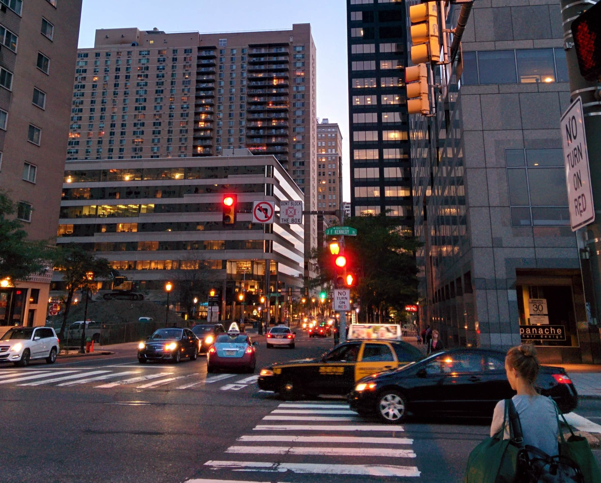
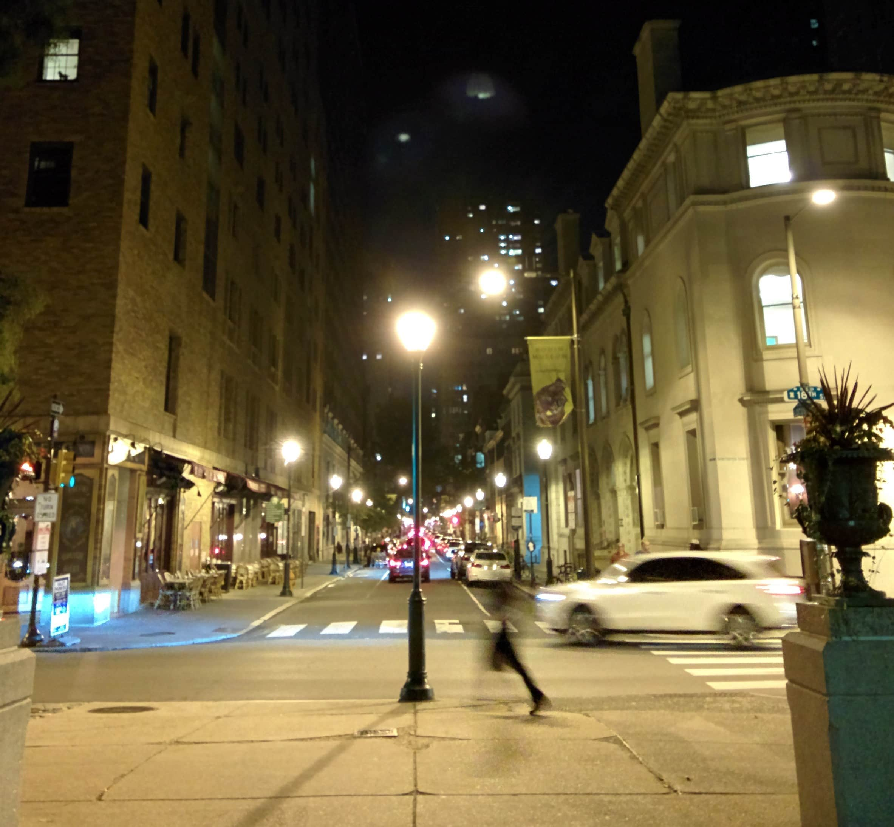
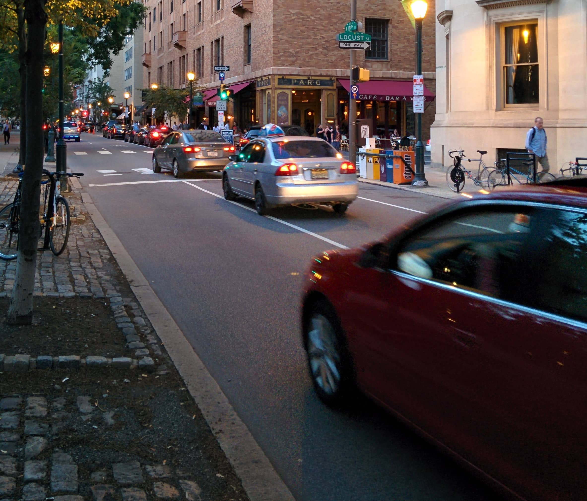

_On Wanting to Live in Cities_

[

I grew up in a city where to stand anywhere in a public place meant to have at least a few hundred people around you, involuntarily invading your personal space at all times. The thing about growing up in cities is that it leaves you with a comfortable ease of navigating such claustrophobic surroundings. It's a bug, and when I find myself in the suburbs, where there might not be a single person visible out in the day unless they're running or mowing their lawn, I'm at an unease. Life is too slow, the people too few.

I've visited almost all of the major cities on the East coast and some in the Mid-West region. I've lived in the suburban areas of PA for the last 5 years, years that have taught me a lot about myself as well as about those who didn't grow up in cities. The most important lesson I've learned about myself is this: I am a lot happier when I'm living in a city.

Part of the reasoning behind wanting to live in a city is to have everything within arm's reach - to not be delayed by means other than my own - such as public transportation or having to find parking for the seemingly prolonged preliminary minutes of entering the city. Call it instant gratification, or a lack of patience; I'd say it's a bit of both. Time is shorter in cities, and even shorter when you're coming in from outside the city. It is no surprise that people walk faster in cities. But to be able to walk down to the nearest cafe or, for the longer days, the nearest tavern and walk back home the very next minute, on your own will, as though having been satisfied merely by the proximity of the destination is a luxury I've found myself craving quite often. The best cities allow you these pleasures excessively. To live on your own schedule, and not on that of a grouchy, unreliable and yet ultimately still helpful public transportation is to live with a certain kind of freedom. A freedom to live on your time, stretch it as far or as little as possible.

[

Then there's also the matter of the life, the lights, and the constant hustle of a city. The concept of time itself being put to test, a shared sense of urgency among city-dwellers that the time to rest is not now. That now is only the time to move and live and grow, to be born at sunrise and be alive into the longest nights, roaming the excessively lit streets alone and together, feeling the pulls and the pushes of our lives. All this, while the city shines bright and prods you on to your next glowing destination.

When I first visited New York on my own, I knew this feeling in its total truth. I was immediately at ease with the constant hundreds of people around me at all times, no matter where I went. For those who say they're in love with New York are often not in love with the city itself but rather its energy. Everything is always moving - people, cars, advertisements, lights, the subway. There is a sense of purpose in each movement. Everything is in flux, but everything is also perfectly in its place. It took me a while to learn to get comfortable with the unease I experienced in the suburbs. For someone to transplant into State College straight out of Delhi is for someone to walk out of NYC into a ghost town. The experience is almost surreal. I also spent a little over an year in Middletown, a town even smaller than State College, and it was a phase of life I wouldn't mind entirely forgetting eventually over time. There, in Middletown, I once met a person who thought the quaint little borough of 8000 people was too crowded. Even though we became good friends over time, I never really understood him until the time he told me he grew up on a farm.

[

Even though I live 10 minutes outside the city, it does not satisfy me. In a 10 minute radius, the vibe is completely different. It's not the suburbs per se, but even on the best days the value of a few extra hundreds going into city-rent is, for me, too great not to consider. Let the money go where the heart finds value, even if that means the weekend expenses taking a hit. So it goes. Today, I walk through the streets knowing that the time to rest will come eventually, when I'll find myself suddenly grown, longing for the quiet sidewalks of the suburbs, for the oak tree at the end of the block that has seen more people move-in and out of the houses than I'll have the chance to meet in my life. Someday it'll be me moving out of the cities and into the suburbs to find some shade, some rest, a slight pause in the hustle where I can breathe and feel myself present. Perhaps the tree will provide a grandfatherly shade. Or it could be the other way around, people from the farms, finding life leading them towards the city, taking cautious steps into the suburbs.

But now in this moment, at the crossroads of twenty-something in our lives, the time feels right only to move, to walk fast and steady onto new adventures, towards new streets and rising buildings, past oak trees and park benches that'll still be around when we're older, past coffee shops without an ambiance, past the chandeliers of the past and the buildings reaching for the stars and the people willing to stop under them. Pause? For what? Someday, some of us will find that we've had enough of the telling. The yearning to constantly be experiencing thrill, adventure, moments. To learn that stories have a way of forming themselves even in the most mundane of moments, but now is only the time to walk out of the bar and stand, for a moment, under the street lights on a cold winter night and think of all the new adventures that are only a few blocks, within our reach, within our dime. No buses, no cars, no time to account for other than our own.

 

---
