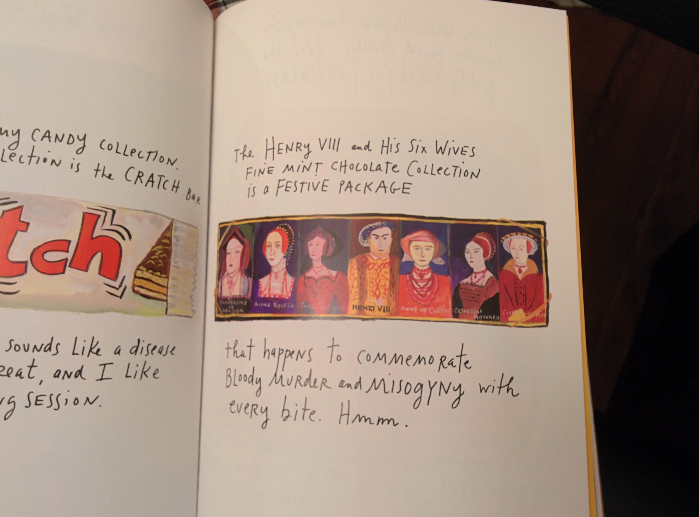

[

Have you ever found yourself picking up a new book without knowing much about it, leafing through the first few pages, maybe even a chapter, and suddenly unable to stop reading? It seldom happens to me to a severe extent. I find that, even given all the availability of time and comfort, I no longer read a book in one sitting.

And yet, a few weeks ago, having just finished brunch with an old friend, I found myself with cancelled plans on a beautiful Saturday afternoon. So I ventured into a Barnes and Noble, picked up Maira Kalman’s The Principles of Uncertainty, found a plush couch in a coffee bar nearby, and began reading. I started around 2 pm and finished the book by 11 pm that night. Between the first page and the last, I drank entirely too much coffee, changed cafes twice, realized how uncomfortable park benches are, and rode a bus back home. The last time I finished a book in one sitting was a year and a half ago in a campus cafe reading Novecento by Alessandro Baricco. In both cases, I was hooked, though for entirely different reasons.

I’ve long felt that the books we truly love are the ones that hold a mirror to ourselves but show us a side of ourselves we weren’t quite able to discern before. Almost like learning who you are through someone else. Even then, Kalman’s work doesn’t tend to fit this simplistic idea. It’s hard to describe this book — if you can even call it that, given it’s equal parts words and art. It’s simply a wonderful journey through Kalman’s mind.

> The heart breaks. Someone does and does not go mad.

“How can I tell you everything that is in my heart?” begins Kalman. As the book proceeds, we’re given a brief history of the extinction of the dodo, informed about the life and fate of various Russian authors (and prominent thinkers), Kalman’s family and their background, about hats, suitcases, and pieces of furniture that Kalman has encountered. This is not, as it may initially seem, some arbitrary collection of information. It is precisely how we encounter life, jumping from thought to thought, place to place, as a means to avoid matters of discomfort, or importance, towards diversions that please us momentarily. Take, for example, the mid-book detour to Paris in order to avoid dealing with philosophy, or more serious and pressing issues such as Nietzsche’s mustache. It is also very funny — something this book does quite well given it tends to discuss war, death, and philosophy, all within a page or two of discussing hats and dodos. It is sometimes incredibly mind-bending realizing how fully aware Kalman is of her environment.

It is also, by far, one of the most profound books I’ve read in a long, long while, even with all its deviations and contradictions and thoughtless-thoughts that end up stringing themselves together to form a mirror on our existence. There are questions of life and death, of war, of life in war, and in the gray areas that arise from conflicts between the self and our larger role in the world. At one point, quite clearly irked at having just had a white shirt stained standing somewhere in Tel Aviv, Israel, Kalman poses the question, “Is there room for pettiness during a war?” At another point, she acknowledges that she has “many questions but no patience to think things through.”

> Everyone is going forward, and everyone is behind everyone.

When I finished reading the book, I thought against writing about it, not because I didn’t want to share it with people but mostly because I didn’t think any description I could come up with regards the book would do it any sufficient justice. I finished it, put it aside and, over the next few weeks, occasionally went back to it flicking to a random page and seeing what came up. It was one of these random page-flipping moments that convinced me to write about it. On an otherwise blank white page were two handwritten lines mentioning Freud’s belief that “what we say means something. And must be spoken.” Below it lies a paragraph on Wittgenstein’s humorous counter-belief. but I’ll let you pick up the book for that one.

 

---
