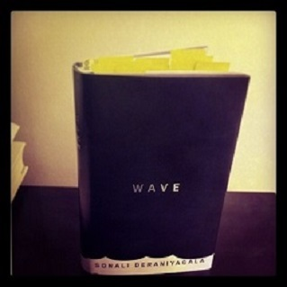

Almost a month ago, I finished reading Wave by Sonali Deraniyagala, and I am still thinking about it. Wave is Deraniyagala’s memoir of dealing with the loss of her family – two sons, husband, and parents – all at once to the 2004 tsunami that hit Sri Lanka, Indonesia, and most of the Indian Subcontinent.

Initially, the book is about grief, immense grief, for Deraniyagala is trying to make sense of the tragedy, trying hard, at times, even to not acknowledge it. Why have I become this wild statistical outlier? she wonders, and refuses, for a while, to look in the mirror (for fear that the cuts and bruises on her face will make the tragedy too real). Wave is brutal and piercing, and a lot of its brutality lies not in the devastation of the tragedy or the quiet pity of human endeavor, but rather in its honesty. It is most painful when Deraniyagala is at her most vulnerable. Out of this tragedy, she has managed to deliver a kind of prose that has depth, that cannot be truly understood in just one read. It demands rereading and asks of the reader how we collectively define grief, and, as a result, how our grief defines our love.

It’s safe to say that the book is a remarkable insight into how the mind deals with despair, but that is not all the book is about. Towards the second half of the book we see Deraniyagala picking up the scattered pieces of her life, one at a time. She revisits her home in London, revisits the site of the disaster, the hotel where they stayed. She drives past her parent’s home (even tortures, for a while, a couple who’ve made residence there). But there are pitfalls as well. The moment she feels she has the strength to go further, to pick up one more piece, visit one more place, remember one more summer day, or even so much as look at one more article of clothing, she falls into relapse of what her life could have been.

In some scary testament (or coincidence) to the tragedy and the wave, Deraniyagala’s arc of going from grief to thoughts of suicide to acceptance and then to love follow the pattern of waves. As soon as she feels she has control over her thoughts, she relapses into the disastrous Why and the What if’s - questions every mind deals with in moments of tragedy, and yet concepts we never fully understand. In Deraniyagala’s case, these moments are magnified, intense, and overbearing. They’re passionate and hurting. They tear her apart, and yet, it is the moments that manage to piece her together. By painfully falling in and out of these moments, she is able to keep her family alive long enough to be able to overcome the relapses.

> “I took it to our bedroom. I struck at the bed. I stabbed the mattress with the muddied pointed end, over and over, harder and harder, until a tear appeared, and again to make the hole deeper and again to make another gash and again to join up all the gashes. The four of us, we slept here in all our innocence. That’ll teach us.”

Wave is about love and acceptance as much as it is about grief, although it is hard to say if one can exist without the other. Its honesty lies in its unsentimental depictions. Wave is not one to provide catharsis or resolution to the reader. There are no such things in Deraniyagala’s memoir, unless one were to think of the act of acceptance as being cathartic. The book ends and you’re left with bigger feelings and questions than when you started - what does it mean to love someone and lose them completely, without any sense of closure?

Most of us will never know the answers to such questions, let alone bear witness to a scale of despair that Deraniyagala went through; but it is only through the few precious accounts such as that of Deraniyagala that we can even begin to ask ourselves such questions.

 

---
