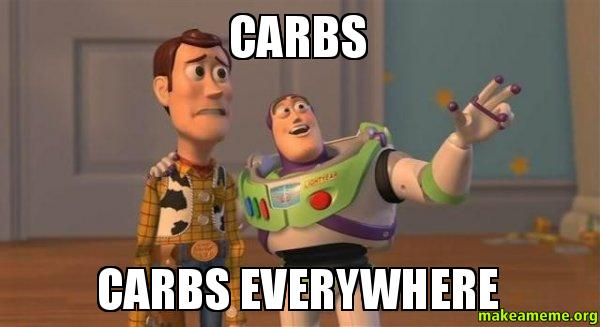

Last Monday (Jan. 11th) I decided to quit eating carbs for one week. My first encounter with this was a couple of years ago, sitting on a family friend's couch, reading about Djokovic's diet that propelled him, within a year, to the top rank. All he did was quit gluten completely and found himself getting stronger everyday. Just one change in diet having that big an effect made me a little skeptical but it stuck around in the back of my mind. Leading up to last week, I'd been reading a lot about the effects of certain food groups on the body. Carbs just stood out as the one group that a lot of people had reduced and felt noticeable improvements with. Now, I had no obvious reason to quit carbs. I'm not trying to lose weight. I'm generally healthy and I tend to eat healthier, home-cooked food more than eating outside. I just wanted to see how much it really affected my body. One of the only triggers beforehand was that I was frequently tired, not only after a full work day but also many times during it.

I read a lot about how people had reduced their carb intake, anywhere from 100 gm. to 200 gm. a day, and seen noticeable improvements. I figured it'd be a pain to keep calculating before each meal how many grams I had left for the day so I decided to go nuclear. For the sake of removing any calculations I decided to do zero carbs for the whole week. Also to ease up on the complexity I focused only on complex-sugar carbs - any kind of breads, pasta, cereal, noodles, rice, sugar, cookies, brownies, dried fruits, etc. I usually don't snack much so most of these weren't a big issue for me. But when you're eating outside at least 4-5 times a week you realize pretty fast how impractical it is to stick to zero carb diets outside your own cooking. To compound that, rice or some kind of bread (roti/paratha/naan) is almost a staple for most Indian meals.

The first two days took a little getting used to. I experienced a minor headache the entire day on my first day. I figured it was because of the lesser calories I was now eating so I upped the protein in my breakfast the next day. The headache was a lot less noticeable the second day and completely gone by the third. My eating out is generally restricted to going out for lunch with coworkers and I realized that sticking to a no-carb diet wasn't going to be so easy.

I had to switch out rice for lettuce in my burrito bowls, opt for salad where there was no substitutable option. (I hate lettuce, but oh well.) This was my first real encounter with having to pay attention to how much "filler" stuff we eat. When you take the rice out of a burrito, for example, it's just a weird looking lump of things awkwardly wrapped inside of a deflating tortilla. (This is just an example, tortillas were forbidden.) Similarly, take any sandwich you can think of and remove the bread. All you're left with is a slice of meat/chicken with some kind of sauce drizzled over it and a bunch of spinach leaves and onions on top. Sounds pretty lame? Yup. The bread makes up at least half the calories of the sandwich. Same situation with any kind of hoagie/cheesesteak/wrap style food. Sushi has rice around it, so do most Indian meals (or at least some kind of bread). Ramen has noodles. Italian is pretty much out the door, unless you only eat meatballs. Same case with most American versions of Mexican and creole food. It took a LOT of creativity and restrictions to be able to buy/makes lunches that had zero carbs. And pair all that with a guy who absolutely could not care less about salads and you have a real situation.

Despite the struggles, I was able to manage through the week with only once breaking the rule. For Wedneday lunch I caved for a sandwich because I was simply too exhausted of having to explain to the server why I wanted to substitute bread for lettuce wraps. The first few days I was generally hungry even after a meal. I was eating significantly fewer calories, even though I was eating more throughout the day. Still, what I noticed was a significant improvement in general energy levels throughout the day. I suspect this was because carbs tend to exaggerate the afternoon food coma post a heavy lunch. So cutting that out helped quite a bit. It did often get kind of frustrating trying to come up with meals that didn't just default to some kind of grains/noodles. I think this is one of the fundamental reasons why people end up just reducing the carb intake instead of letting it go completely. Also maybe because carbs are just simply delicious.

I don't think it's practical to cut out carbs completely, but I did have a consistent higher energy level throughout the week. Because I also cut out sugar for the week I noticed that my body wasn't "crashing" from sugar-highs anymore. I could be back from a full day of work and still be productive till midnight or so. I also think it's one of the most effective ways to lose weight since you're eating fewer calories with every meal. Cutting out just one aspect of a diet as opposed to overhauling it completely is also easier to stick to. I was pretty conscious about this though - I wasn't trying to lose weight so I made sure I ate more small meals through the day to account for the cut in calorie count. That said, I think it's worth it at least once or twice a year to try this and see how your body reacts. I'm by no means cutting out carbs completely but I think I've realized I need to decrease their amount in my diet.

https://twitter.com/fmanjoo/status/687755569311035392

Couple of pointers and things that I noticed:

- I was focusing only on eradicating complex-sugar carbs and food products where carbs are the primary ingredient (grains, for example). No specific reason, it's just easier to do. Even Kale has carbs, but it's not the majority/primary ingredient.
- The first two or three days generally take getting used to since your body is expecting more food than you're giving it. You might have a minor headache.
- If you stick to your general meal count, you end up eating fewer calories than you normally would. This is because most of the calorie intake happens through high-carb foods like breads, pasta, tortillas, rice, etc.
- You _can_ eat a lot more throughout the day as opposed to two or three big meals since all your meals are now smaller.
- Almost everything I read mentioned the person losing weight when this was followed for longer periods of time. I didn't notice any weight change in one week.
- I felt a lot less tired. This is the single-most vivid and biggest change I noticed. Because the amount of calories going in at once decreased I felt that the general tendency of a minor afternoon workplace food-coma also dramatically decreased. I actually went through a whole day feeling active and energetic throughout.
- Maintaining a zero carb diet can get expensive - you have no "filler" foods so your general entrée consumption increases.

 
